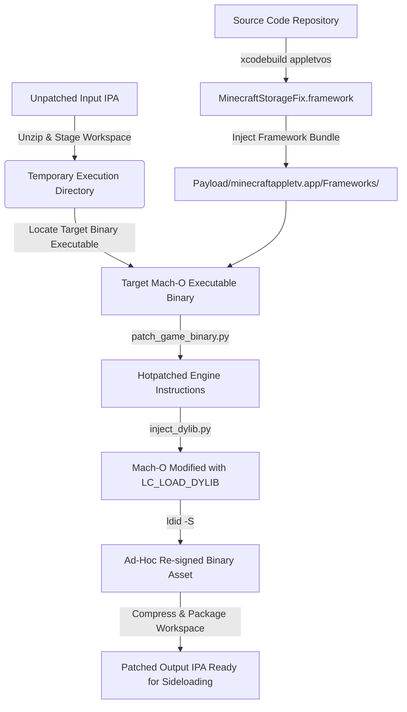

# Minecraft tvOS Restoration Project (`tweak-1.3`)

This repository contains an advanced, low-level runtime repair and compatibility framework designed to restore full offline and local functionality to legacy editions of **Minecraft for tvOS (Apple TV)**.

Discontinued versions of the Bedrock engine heavily rely on server architectures, iCloud containers, and platform entitlement structures that are completely absent or strictly blocked in modern tvOS sideload environments. This project compiles an Objective-C injection runtime (`MinecraftStorageFix`) that intercepts low-level system calls, hot-patches internal C++ engine vtables, emulates missing platform traits, and introduces localized management utilities directly into the game process.

---

## Subsystem Framework Architecture

The framework is systematically separated into targeted engineering layers, decoupling low-level POSIX abstractions from high-level Objective-C swizzling and runtime binary memory adjustments.

```text
┌────────────────────────────────────────────────────────┐
│         Layer 5 & 7: C++ Engine Vtable Patches         │
│     (vm_protect, Gate 1-3, IO Completion, LevelDB)     │
└───────────────────────────┬────────────────────────────┘
                            ▼
┌────────────────────────────────────────────────────────┐
│   Layer 6 & 6a: High-Level NSFileManager Redirection   │
│   (Sandbox Escaping, Ubiquity Emulation, Group URLs)   │
└───────────────────────────┬────────────────────────────┘
                            ▼
┌────────────────────────────────────────────────────────┐
│    Layer 1, 2 & 3: CloudKit & Notification Shims       │
│   (FakeCKContainer, Swizzled Completion Block Logic)   │
└───────────────────────────┬────────────────────────────┘
                            ▼
┌────────────────────────────────────────────────────────┐
│     Layer 4: POSIX Abstractions & Darwin Extensions    │
│   (fishhook POSIX I/O, $INODE64, Background FTP Daemon)│
└────────────────────────────────────────────────────────┘
```

### 1. Layer 4: POSIX Redirection & Darwin Inode Extensions

During the earliest initialization sequence (**Phase A**), the framework implements immediate runtime rebindings through `fishhook` to capture POSIX filesystem activity before any engine directories are instantiated on disk.

- **Advanced platform matching:** The framework rebinds standard libc signatures along with explicit Darwin subsystem variants:
  - Standard file operations: `open`, `fopen`, `mkdir`, `access`, `stat`, `lstat`, `opendir`, `rename`, `unlink`, `rmdir`, `remove`.
  - Extended 64-bit inode definitions: `fopen$DARWIN_EXTSN`, `stat$INODE64`, `lstat$INODE64`, `opendir$INODE64`.
- **Embedded background FTP daemon:** To enable direct remote file access on physical Apple TV hardware without third-party file utilities, initialization spawns an integrated FTP server on a background queue (VFS root = game data mirror):

```objc
dispatch_async(dispatch_get_global_queue(DISPATCH_QUEUE_PRIORITY_DEFAULT, 0), ^{
    [MCFIXFTPServer start];
});
```

Default control port: **2121** (passive data ports in the 12000–12999 range). See `MinecraftStorageFix/Modules/Server/MCFIXFTPServer.m`.

### 2. Layers 1, 2 & 3: CloudKit & Notification Emulation

The original save-synchronization architecture queries App Store provisioning containers on application startup. Sideloaded environments trigger immediate lifecycle notification callbacks that can read uninitialized memory inside the engine’s C++ object graphs, leading to immediate crashes.

- **Surgical notification silencing:** Objective-C runtime swizzling replaces `-[iCloudNotificationListener iCloudAccountAvailabilityChanged:]` with an explicit no-op.
- **Token hardening:** `-[NSFileManager ubiquityIdentityToken]` is overridden to persistently return a mock authentication string (`mcfix-sideload-ubiquity-token`). An observer watches `NSUbiquityIdentityDidChangeNotification` and re-injects the fake token if a profile drop occurs.
- **Container block substitution:** `CKContainer` selectors (`defaultContainer`, `containerWithIdentifier:`) are intercepted to return `FakeCloudContainer`. `setQueryCompletionBlock:` and `setModifyRecordsCompletionBlock:` on `CKQueryOperation` / `CKModifyRecordsOperation` are wrapped so completion handlers receive success-shaped empty payloads, forcing fallback to local storage paths.

### 3. Layers 6 & 6a: Sandbox Trapping & Virtual Directories

Physical tvOS application sandboxes enforce hard write restrictions on layouts like `Library/Application Support` or `Documents/games`.

- **Layer 6 (container relocation):** Swizzles `containerURLForSecurityApplicationGroupIdentifier:` and `URLForUbiquityContainerIdentifier:` to shift app-group and iCloud simulation URLs into writable cache hierarchies:

```text
$HOME/Library/Caches/AppGroupContainers/
$HOME/Library/Caches/iCloudContainerSim/
```

- **Layer 6a (NSFileManager redirection matrix):** **18** `NSFileManager` instance methods are swizzled for game-path operations (create, exists, copy, move, remove, enumerate, attributes, URL variants, etc.), routing through `MCFIXPathByRedirectingGameStorage` into the persistent VFS mirror:

```text
$HOME/Library/Caches/MinecraftStorageFix/GameData/vfs/
```

- **World thumbnail path tracing:** Additional hooks on `contentsAtPath:` and `dataWithContentsOfFile:options:error:` (plus POSIX/fishhook paths) ensure world list thumbnails and related UI assets resolve without sandbox reference errors.

**Bootstrap note:** Phase B migrations (`MCFIXRunBootstrapPhaseB`) run synchronously *before* NSFileManager swizzles activate, so early-start races do not corrupt migrated data.

### 4. Layers 5 & 7: Core C++ Engine Vtable Patching

Critical platform validations, storage initialization paths, and asset streaming lines live in pre-compiled C++ structures. The framework uses Mach virtual memory APIs to patch vtable slots inside read-only `__DATA_CONST` pages:

```objc
uintptr_t pageBase = (uintptr_t)slot & ~((uintptr_t)vm_page_size - 1);
vm_protect(mach_task_self(), (vm_address_t)pageBase, (vm_size_t)vm_page_size, FALSE, VM_PROT_READ | VM_PROT_WRITE);
*slot = newFn;
vm_protect(mach_task_self(), (vm_address_t)pageBase, (vm_size_t)vm_page_size, FALSE, VM_PROT_READ);
```

| Target component identifier | Static vtable slot symbol | Runtime bypass behavior |
| --- | --- | --- |
| **iCloud Gate 1** | `kVtableSlot1` | Bypass primary initial entry verification checkpoints |
| **iCloud Gate 2** | `kVtableSlot2` | Safeguard inner tracking subsystems; prevent early cloud setup stalls |
| **iCloud Gate 3** | `kVtableSlot3` | Suppress blocking “Turn on iCloud” modal path |
| **Permissions dispatcher** | `kDispatcherSlot` | Force success while preserving observer notification chain (prevents UAF `SIGABRT` during world generation) |
| **IO streaming monitor** | `kIoCallbackSlot` | Null-guard streaming callback pointers (multi-threaded load races) |
| **IO batch closer** | `kIoCallbackSlot2` | Protect teardown/exit paths as menus dismantle |
| **LevelDB sync matrix** | `kSyncSlot`, `kNoQuerySlot`, `kNoWipeQueueSlot` | Halt cloud backup (`-SYNC-N`); keep LevelDB transactions on local cache paths |

### 5. Multi-Threaded Late-Binding Engine

Secondary modules (Xbox Live identities, MSA device client, keychain storage) may register in the Objective-C runtime *after* `+load`. Static-only hooks can miss these classes.

The framework uses a `dispatch_source_t` timer on a utility queue, polling every **250 ms** (up to ~6 s) until targets bind:

```objc
dispatch_source_set_timer(src,
    dispatch_time(DISPATCH_TIME_NOW, (int64_t)(0.25 * NSEC_PER_SEC)),
    (uint64_t)(0.25 * NSEC_PER_SEC), (uint64_t)(50 * NSEC_PER_MSEC));
dispatch_source_set_event_handler(src, ^{
    if (!atomic_load(&sKeychainHooked)) {
        if ([MinecraftStorageFix installXBLKeychainAccessGroupFixOnce]) { ... }
    }
    // Also binds XBLServiceManager guards and XBLMSADeviceClient msaAppID when ready
});
```

- **Keychain remapping (`securityd -34018`):** Combines `-[XBLKeychainStorage dictionaryForKeychainQuery:]` swizzling with `fishhook` on `SecItemAdd`, `SecItemCopyMatching`, `SecItemUpdate`, and `SecItemDelete`, stripping `kSecAttrAccessGroup` where needed so tokens persist in the app’s local provisioning scope.
- **Notification fixes:** Remote notification registration and authorization paths are patched to reduce sandbox noise and unexpected authorization stalls during sideload startup.

### 6. Static binary patches (inject pipeline only)

Runtime framework hooks are complemented by **two ARM64 instruction patches** applied to `minecraftappletv` at IPA build time (`scripts/patch_game_binary.py`, tvOS **1.1.5** signatures):

| Function | Behavior |
| --- | --- |
| `sub_1006634DC` | Force catalog “owned” gate true |
| `sub_100369B34` | Force skin padlock UI evaluator false |

These are **not** a separate “hybrid” build—they are applied inside `build_and_inject_ipa.sh` when producing `*_MCStorageFix.ipa`.

---

## Repository Layout

```text
├── MinecraftStorageFix.xcodeproj/   # Xcode construction profiles
├── MinecraftStorageFix/             # Framework patch core source files
│   ├── MinecraftStorageFix.m        # Execution core, layer orchestration, & method extensions
│   ├── fishhook.c / fishhook.h      # Mach-O symbol rebinding engine (under Modules/Vendor/)
│   └── Modules/                     # Dedicated environment modules
│       ├── CloudKit/                # Vtable profiles, fake containers, & completion shims
│       ├── VFS/                     # Path corrections, POSIX hooks, NSFileManager matrix, bootstrap
│       ├── Xbox/                    # Keychain filtering & login stability layers
│       ├── Icons/                   # Asset location tracers & world picture trackers
│       ├── Server/                  # Background FTP daemon (MCFIXFTPServer)
│       ├── Marketplace/             # Offline catalog / entitlement identity bridge
│       ├── Lifecycle/               # Watchdogs, platform capture, diagnostics
│       └── Sideload/                # Push/notification sideload mitigations
├── BUILD_NOW.command                # macOS double-click → same inject pipeline (1.1.5 defaults)
└── scripts/                         # Injection automation infrastructure
    ├── build_and_inject_ipa.sh      # Core shell injection orchestration
    ├── inject_dylib.py              # Inserts LC_LOAD_DYLIB (not optool)
    └── patch_game_binary.py         # Static ARM64 instruction patches (1.1.5)
```

---

## Assembly & Injection Pipeline

The system uses a fully automated shell and Python chain to compile the framework, rewrite the main executable, inject load commands, and repackage an IPA.



### What this pipeline is (and is not)

This script does **not** build a `hybrid_*` asset-merge IPA. It produces **`*_MCStorageFix.ipa`** by:

1. Embedding **`MinecraftStorageFix.framework`** (all runtime layers above)
2. Running **`patch_game_binary.py`** on `minecraftappletv` (1.1.5 static patches)
3. Adding **`LC_LOAD_DYLIB`** for `@executable_path/Frameworks/MinecraftStorageFix.framework/MinecraftStorageFix`

Any external “hybrid” prep is only an optional **input** IPA; output naming stays `*_MCStorageFix.ipa`.

### Verification requirements

- **Full Xcode** at `/Applications/Xcode.app` (Command Line Tools alone are insufficient)
- Apple TV SDK / `appletvos` target
- `python3`
- `ldid` on `PATH`
- `zip` / `unzip`
- `otool` (optional verify; ships with Xcode — **not** `optool`)

### Execution

```bash
cd /path/to/tweak-1.3
./scripts/build_and_inject_ipa.sh "Minecraft_1.1.5_decrypted.ipa"
```

Custom output name:

```bash
./scripts/build_and_inject_ipa.sh "Minecraft_1.1.5_decrypted.ipa" "Minecraft_tvOS_Restored.ipa"
```

Defaults (no arguments) or **double-click `BUILD_NOW.command`**:

- Input: `Minecraft_1.1.5_decrypted.ipa`
- Output: `Minecraft_1.1.5_MCStorageFix.ipa`

Help:

```bash
./scripts/build_and_inject_ipa.sh --help
```

### Pipeline steps (behind the scenes)

1. `xcodebuild` → `MinecraftStorageFix.framework` (`CODE_SIGNING_ALLOWED=NO`)
2. Unzip IPA → `ipa_inject_work/`
3. Copy framework → `Payload/minecraftappletv.app/Frameworks/`
4. `patch_game_binary.py` on `minecraftappletv`
5. `inject_dylib.py` → `LC_LOAD_DYLIB`
6. `ldid -S` on main binary
7. `otool -L` verify, zip → output IPA, log to `build_inject.log`

If `patch_game_binary.py` signature checks fail, the input binary is not tvOS **1.1.5** (or was already modified).

---

## Runtime Debug Diagnostics

A watchdog monitors bootstrap stall state. If setup loops hang, diagnostics poll every **2 seconds** (up to ~40 s) until the main menu is observed (`gMCFIXMenuPresented`).

Filter device logs (Console.app / `log stream`) by subsystem tags:

| Tag | Purpose |
| --- | --- |
| `MCFIX CK` | CloudKit interceptions, container simulation, completion blocks |
| `MCFIX Boot` | Platform capture, early directory creation, migrations |
| `MCFIX Icon` | World/achievement icon path routing and read traces |
| `MCFIX Err` | Validation failures, `vm_protect` issues, permission drops |

### Build / inject troubleshooting

| Symptom | Likely cause | What to check |
| --- | --- | --- |
| `ERROR: missing <ipa>` | Wrong path | IPA path argument |
| `xcodebuild` fails | Xcode/SDK | Full Xcode + tvOS SDK |
| `ldid not on PATH` | Missing tool | Install `ldid` |
| `signature mismatch` in patch step | Wrong game version | Use 1.1.5 `minecraftappletv` or update `patch_game_binary.py` |
| `MinecraftStorageFix load command missing` | Inject failed | `build_inject.log`, `inject_dylib.py` |

---

## Legal / Distribution Notes

- This repository does **not** include Mojang/Microsoft game IPAs or copyrighted game assets.
- You must supply your own legally obtained IPA for injection.
- Keep generated IPAs, `dd_build/`, `ipa_inject_work/`, and logs out of git (see `.gitignore`).

---

*Disclaimer: This project is an independent historical preservation and reverse-engineering research effort. It is not affiliated with, endorsed by, or associated with Mojang Studios, Microsoft, or Apple Inc.*
