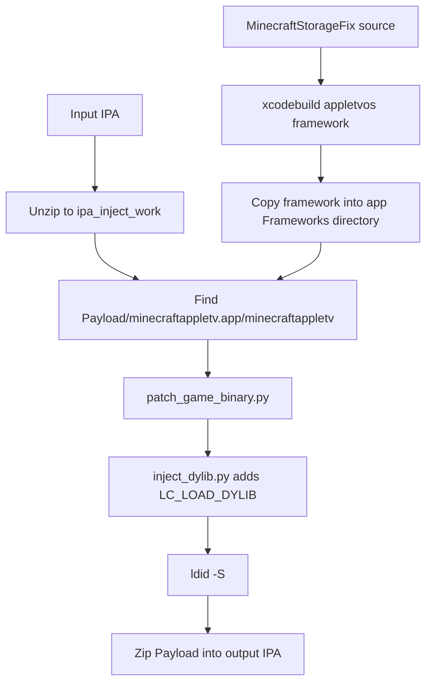

# Minecraft tvOS Restoration Project

`tweak-1.3` builds and injects `MinecraftStorageFix.framework`, a runtime compatibility layer for legacy **Minecraft: Apple TV Edition / Minecraft Bedrock tvOS** builds.

The goal is practical: make a decrypted tvOS IPA boot and keep local gameplay data working in a modern sideload environment where the original game expects App Store entitlements, iCloud containers, CloudKit, and writable paths that no longer behave the way the old engine expects.

This repository does **not** contain Minecraft IPAs or copyrighted game assets. You provide your own legally obtained decrypted IPA.

## What It Does

- Builds `MinecraftStorageFix.framework` for `appletvos`.
- Injects the framework into `Payload/minecraftappletv.app/Frameworks/`.
- Adds an `LC_LOAD_DYLIB` command so the framework loads at app startup.
- Applies two static ARM64 patches to the tvOS **1.1.5** `minecraftappletv` binary.
- Re-signs the modified app binary with `ldid`.
- Repackages the result as `*_MCStorageFix.ipa`.

This is **not** a `hybrid_*` asset-merge builder. If you have a hybrid IPA from another workflow, you can pass it in as input, but this script still produces a framework-injected `*_MCStorageFix.ipa`.

## Current Target

The automated binary patch step currently targets:

- Minecraft tvOS **1.1.5**
- Main executable name: `minecraftappletv`
- Expected app path inside IPA: `Payload/minecraftappletv.app`

`scripts/patch_game_binary.py` validates the expected 1.1.5 instruction bytes before writing. If the signatures do not match, the script stops instead of blindly patching the wrong binary.

## Main Runtime Fixes

### Local Storage / VFS Redirect

Legacy Bedrock code writes to paths such as:

```text
Library/games/
Documents/games/
tmp/Temp/games/
tmp/minecraftpe/
```

Modern sideloaded tvOS apps can hit sandbox denials or lose data in temporary locations. `MinecraftStorageFix` redirects those game-data paths into a writable cache-backed mirror:

```text
$HOME/Library/Caches/MinecraftStorageFix/GameData/vfs/
```

The redirect is installed in two places:

- POSIX hooks via `fishhook` for calls like `open`, `fopen`, `mkdir`, `stat`, `opendir`, `rename`, `unlink`, `remove`, and Darwin variants such as `stat$INODE64`.
- `NSFileManager` / `NSData` swizzles for Foundation-level file checks, directory enumeration, and world-icon reads.

Bootstrap code also seeds required local files, migrates existing data into the VFS mirror, syncs skin/preferences data, and prepares achievement/world icon paths.

### iCloud / CloudKit Compatibility

The original game can enter cloud-save paths even when the sideloaded app has no valid iCloud container. The framework prevents those unavailable services from blocking startup:

- Returns a stable fake ubiquity identity token.
- Swizzles CloudKit container creation to a fake local container.
- Wraps CloudKit query/modify completion blocks with safe empty-success responses.
- Silences iCloud account-change callbacks that otherwise drive broken cloud-state evaluation.
- Patches C++ iCloud gate vtable slots at runtime where Objective-C hooks are not enough.

### Marketplace / Offline Catalog Support

The project includes local marketplace/catalog helpers for the old engine’s offline expectations:

- Seeds working `catalog_info.json` stub data with the layout expected by the 1.1.5 binary.
- Bridges local identity values used by entitlement/cache code.
- Applies static ownership/UI patches during IPA injection:
  - `sub_1006634DC` -> force catalog ownership gate true.
  - `sub_100369B34` -> force skin/pack padlock UI evaluator false.

### Sideload / Xbox Hardening

Sideloaded builds can fail entitlement and Keychain checks, commonly showing `securityd` `-34018` behavior. The framework reduces those failures by:

- Removing incompatible Keychain access-group fields for Xbox Live service queries.
- Hooking `SecItemAdd`, `SecItemCopyMatching`, `SecItemUpdate`, and `SecItemDelete`.
- Late-binding Xbox-related Objective-C classes after they appear in the runtime.
- Replacing unsupported push notification / authorization paths with safe local behavior.
- Adding StoreKit receipt/payment shims needed by some offline chooser flows.

### Local Device File Access

An embedded FTP server is started on device for local LAN access to the VFS-backed game data:

- FTP control port: `2121`
- Passive data range: `12000-12999`
- Root: MinecraftStorageFix game-data sandbox

This is intended for local debugging and world-file management on Apple TV hardware.

## Build And Inject

### Requirements

- macOS
- Full Xcode installed at `/Applications/Xcode.app`
- Apple TV SDK (`appletvos`)
- `python3`
- `ldid` on `PATH`
- `zip` and `unzip`

`optool` is **not** required. The repo uses `scripts/inject_dylib.py` to add the Mach-O load command. `otool` is only used for verification.

### One Command

From the repository root:

```bash
./scripts/build_and_inject_ipa.sh "Minecraft_1.1.5_decrypted.ipa"
```

Default output:

```text
Minecraft_1.1.5_MCStorageFix.ipa
```

Custom output:

```bash
./scripts/build_and_inject_ipa.sh "Minecraft_1.1.5_decrypted.ipa" "Minecraft_tvOS_Restored.ipa"
```

Help:

```bash
./scripts/build_and_inject_ipa.sh --help
```

On macOS, `BUILD_NOW.command` is a double-click wrapper around the same script. With no arguments, it uses:

```text
input  = Minecraft_1.1.5_decrypted.ipa
output = Minecraft_1.1.5_MCStorageFix.ipa
```

## Pipeline



Behind the scenes:

1. Builds `MinecraftStorageFix.framework` into `dd_build/`.
2. Extracts the IPA into `ipa_inject_work/`.
3. Copies the framework into the app bundle.
4. Runs `patch_game_binary.py` against `minecraftappletv`.
5. Runs `inject_dylib.py` with:

   ```text
   @executable_path/Frameworks/MinecraftStorageFix.framework/MinecraftStorageFix
   ```

6. Re-signs the main executable with `ldid -S`.
7. Verifies the load command with `otool -L`.
8. Writes the final IPA and logs details to `build_inject.log`.

## Repository Layout

```text
MinecraftStorageFix.xcodeproj/       Xcode project
MinecraftStorageFix/                 Framework source
  MinecraftStorageFix.m              Main +load orchestration and runtime hooks
  Modules/
    CloudKit/                        Fake containers, completion shims, vtable patches
    VFS/                             POSIX hooks, path redirect, bootstrap, NSFileManager swizzles
    Marketplace/                     Offline catalog and entitlement helpers
    Xbox/                            Keychain and Xbox runtime hardening
    Icons/                           World and achievement icon handling
    Server/                          FTP / local file-management support
    Sideload/                        Sideload entitlement, StoreKit, notification fixes
    Lifecycle/                       Platform capture and watchdog diagnostics
    Vendor/                          fishhook
scripts/
  build_and_inject_ipa.sh            Build, patch, inject, repackage
  inject_dylib.py                    Mach-O LC_LOAD_DYLIB injector
  patch_game_binary.py               1.1.5 ARM64 binary patches
  analyze_mcfix_log.py               Log analysis helper
  scan_vfs_tree.py                   VFS inspection helper
  paths_to_tree.py                   Path-list formatting helper
BUILD_NOW.command                    macOS double-click wrapper
entitlements.plist                   Signing entitlement template/reference
```

## Diagnostics

Most production builds are quiet by default. Logging is controlled in `MinecraftStorageFix/Modules/Log/MCFIXLog.h`:

```objc
#define MCFIX_PRODUCTION_SILENT 1
```

For debugging, rebuild with logging enabled and filter device logs for:

- `MCFIX Boot` - startup, bootstrap, migrations
- `MCFIX VFS` - storage redirects and VFS setup
- `MCFIX CK` - CloudKit/iCloud shims
- `MCFIX Icon` - world and achievement icon paths
- `MCFIX XBL` - Xbox/keychain hardening
- `MCFIX Err` - errors and failed runtime patches

The lifecycle watchdog polls startup progress while the game is booting and can help identify stalls before the main menu appears.

## Troubleshooting

### `ERROR: missing ...ipa`

The input IPA path is wrong or the file is not in the repo root. Pass an absolute path or place the IPA next to the script.

### `ldid not on PATH`

Install `ldid` and make sure it is visible to your shell:

```bash
which ldid
```

### `xcodebuild` fails

Make sure full Xcode is installed, not only Command Line Tools:

```bash
xcodebuild -version
xcodebuild -showsdks | grep appletvos
```

### `signature not found` or `bytes mismatch`

The main binary does not match the expected tvOS 1.1.5 executable, or it has already been patched. Update `scripts/patch_game_binary.py` for that binary before using it on another version.

### Framework load command missing

Check `build_inject.log`. The expected load command is:

```text
@executable_path/Frameworks/MinecraftStorageFix.framework/MinecraftStorageFix
```

## Notes

- Generated IPAs, temporary build folders, and logs are intentionally ignored by git.
- `dd_build/`, `ipa_inject_work/`, `build_inject.log`, `Payload/`, and `*.ipa` should stay out of the repository.
- This is a research and preservation project for locally owned copies. Do not distribute game binaries or copyrighted assets.

## Disclaimer

This project is an independent historical preservation and reverse-engineering research effort. It is not affiliated with, endorsed by, or associated with Mojang Studios, Microsoft, or Apple Inc.
